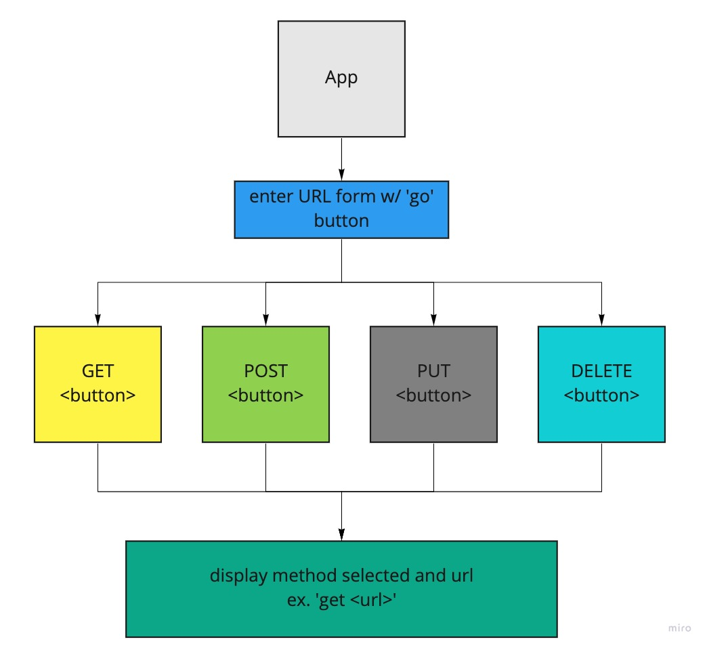

<h1 align="center">Welcome to RESTy 👋</h1>
<p>
  <a href="#" target="_blank">
    
  </a>
</p>

## Install

```sh
npm install
```

## Usage

```sh
npm run start
```

## Run tests

```sh
npm run test
```

## Author

👤 **Mark Thanadabouth**

## Deployment

[Phase 1 Deployment](https://codesandbox.io/s/inspiring-fast-txi2r?file=/src/index.js)

[Phase 2 Deployment(gh-pages)](https://markjackson28.github.io/resty/)

## UML



# Component Based UI

## Lab Requirements

### Phase 1

Students will be creating and styling a Counter application. Look for the following attributes

- `Header`, `Footer`, and `Counter` components to separate files
- Properly `export` them as defaults
- Import them into the `App` Component using ES6 `import` statement
- Proper state management
- Button Handlers
  - Bonus if they can wire both buttons with one handler

### Phase 2

We will be receiving user input in preparation of connecting to live APIs, using the `useState()` hook in our functional components

The following user stories detail the major functionality for this phase of the project.

- As a user, I want to enter the REST Method and URL to an API
- As a user, I want to see a summary of my request as well as results returned from an API request in my browser in a readable format

### Phase 3

In phase 3, we will be connecting RESTy to live APIs, fetching and displaying remote data. Our primary focus will be to service GET requests

The following user stories detail the major functionality for this phase of the project.

- As a user, I want to enter the URL to an API and issue a GET request so that I can retrieve it’s data
- As a user, I want to see the results returned from an API request in my browser in a readable format

### Phase 4

In phase 4, we will be tracking every API call and storing it in history

The following user stories detail the major functionality for this phase of the project.

- As a user, I want to see a list of my previous API calls, so that I can see the results again, quickly

### Resources

[How to deploy to gh-pages](https://medium.com/mobile-web-dev/how-to-build-and-deploy-a-react-app-to-github-pages-in-less-than-5-minutes-d6c4ffd30f14)

***
_This README was generated with ❤️ by [readme-md-generator](https://github.com/kefranabg/readme-md-generator)_
